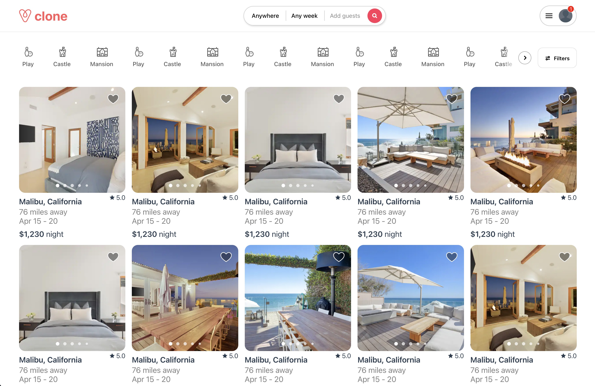

# airbnb-clone

An [exploration](https://airbnb-clone-1yhq.onrender.com/) of UI/UX polish and intermediate-advanced Vue.js design patterns and CSS approaches. Many of the UI elements present in the front-page of Airbnb were copied, including carousels, drop-downs, and a button with a radial hover
effect.



## Project setup

```
npm install
```

### Compiles and hot-reloads for development

```
npm run serve
```

### Compiles and minifies for production

```
npm run build
```

### Lints and fixes files

```
npm run lint
```

### Customize configuration

See [Configuration Reference](https://cli.vuejs.org/config/).
